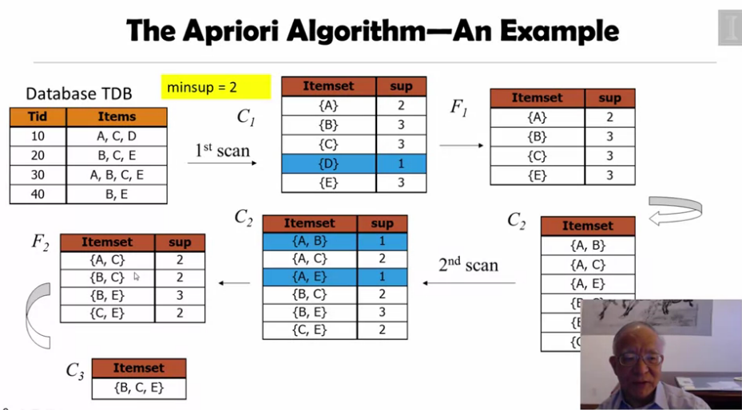

- {{today}} - it is generated by macro set in config.edn "{ { today } }"
- #+BEGIN_QUERY
  {
  :title [:b "journalsbetween - find future journals in a date range"]
  :query [:find (pull ?block [*])
  :in $ ?startdate ?enddate
  :where
  [?block :block/name ?pagename]
  [?block :block/journal-day ?journaldate]
  [(>= ?journaldate ?startdate)]
  [(<= ?journaldate ?enddate)]
  ]
  :inputs [:yesterday :today-6d]
  }
  #+END_QUERY
- query-sort-by:: created-at
  query-sort-desc:: true
  #+BEGIN_QUERY
  {
  :title [:b "pages command - specific pages"]
  :query [:find (pull ?block [*])
  :where
  [?block :block/name ?pagename]
  ( or
  [?block :block/name "whatsapp-groupchat-analyzer"]
  [?block :block/name "github"]
  [?block :block/name "pypi"]
  )
  ]
  }
  #+END_QUERY
- [[COL761 Data Mining]]
	- Closed pattern and max pattern
	- Downward pattern
	- Process
		- given the transaction items-> write freq of each items
		- Frequent pattern set F1 -> built using removing all non support items
		- Apriori prunning Principle : If item(/set) is infrequent, its superset should not be generated
		- ```python
		  while fk != null:
		    ck+1 = generate_c(fk)
		    fk+1 = generate_f(ck+1)
		    k = k+1
		  return UkFk
		  ```
		- 
	-
	- to create an element of size k ... sets having k-2 element as common needs to be merged
	- Prune if subsets are not frequent